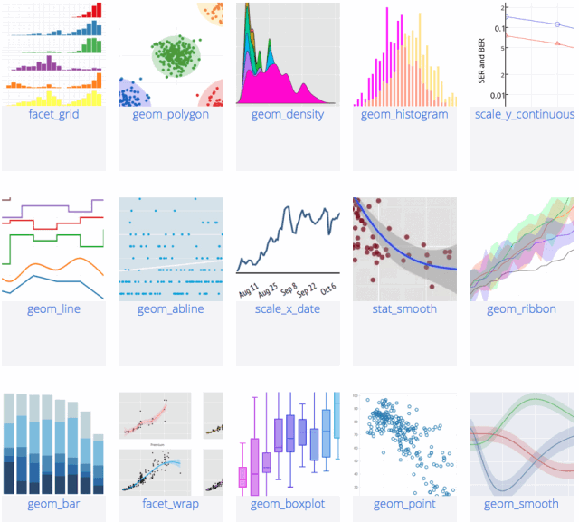

# Software R estadistic

R es un lenguaje de programación y entorno de software libre para el análisis estadístico y gráficos. Fue desarrollado originalmente por Ross Ihaka y Robert Gentleman en la Universidad de Auckland, Nueva Zelanda, y es ampliamente utilizado en investigación estadística, análisis de datos y minería de datos en una variedad de campos, incluyendo la biología, economía y ciencias sociales.

# Usos de R

- Análisis estadístico: R cuenta con una gran cantidad de funciones estadísticas incorporadas, así como una amplia variedad de paquetes y librerías para realizar tareas estadísticas avanzadas.
- Gráficos: R cuenta con una gran cantidad de funciones para crear gráficos de alta calidad, incluyendo gráficos de línea, barras, histogramas y mapas.
- Minería de datos: R cuenta con una amplia variedad de paquetes y librerías para realizar tareas de minería de datos, como análisis de cluster y aprendizaje automático.
- Procesamiento de datos: R cuenta con una gran cantidad de funciones para limpiar y transformar datos, lo que lo convierte en una herramienta poderosa para el procesamiento de datos.
- Integración con otros lenguajes: R cuenta con funciones para interactuar con otros lenguajes de programación, como Python y SQL, lo que facilita la integración de R en un flujo de trabajo de análisis de datos más amplio.



# Comunidad y Recursos

R cuenta con una gran comunidad activa que contribuye constantemente a mejorar el lenguaje y desarrollar nuevos paquetes y librerías. Hay una gran cantidad de recursos disponibles en línea para aprender R, incluyendo tutoriales, documentación y cursos en línea. Algunos ejemplos incluyen:

- [CRAN](https://cran.r-project.org/)
- [RStudio](https://rstudio.com/)
- [R-bloggers](https://www.r-bloggers.com/)
- [DataCamp](https://www.datacamp.com/courses/free-introduction-to-r)

R es una herramienta poderosa para el análisis de datos, con una gran cantidad de funciones y paquetes disponibles para realizar tareas estadísticas y de minería de datos avanzadas. Con una gran comunidad y una gran cantidad de recursos disponibles, aprender R es fácil y accesible.

# Objetos y operaciones básicas

- Asignación de valores a variables

```r
x <- 5
y <- 3.14
z <- "Hello, World!"
```

- Operaciones aritméticas

```r
suma <- x + y
resta <- x - y
multiplicacion <- x * y
division <- x / y
modulo <- x %% y
potencia <- x^2
```

- Funciones matemáticas

```
raiz_cuadrada <- sqrt(x)
valor_absoluto <- abs(y)
seno <- sin(x)
logaritmo <- log(x)
```

- Vectores

```r
vec <- c(1, 2, 3, 4, 5)  # Crear un vector
longitud <- length(vec)  # Obtener la longitud del vector
primer_elemento <- vec[1]  # Acceder al primer elemento del vector
suma_vector <- sum(vec)  # Calcular la suma de los elementos del vector
```

-  Data Frames

```
df <- data.frame(
  nombre = c("Juan", "María", "Pedro"),
  edad = c(25, 30, 28),
  altura = c(1.75, 1.60, 1.80)
)  # Crear un data frame

filas <- nrow(df)  # Obtener el número de filas del data frame
columnas <- ncol(df)  # Obtener el número de columnas del data frame
nombres_columnas <- colnames(df)  # Obtener los nombres de las columnas del data frame

# Acceder a los valores del data frame por fila y columna
valor <- df[1, 2]  # Valor en la primera fila, segunda columna
```

# Análisis estadístico

- Cáculo de estadísticas descriptivas

```r
mean(vec)  # Calcular la media del vector
median(vec)  # Calcular la mediana del vector
sd(vec)  # Calcular la desviación estándar del vector
var(vec)  # Calcular la varianza del vector
```

- Pruebas estadísticas

```r 
t.test(vec1, vec2)  # Realizar una prueba t de Student entre dos vectores
anova(modelo)  # Realizar un análisis de varianza (ANOVA)
cor(vec1, vec2)  # Calcular la correlación entre dos vectores
lm(y ~ x, data = df)  # Ajustar un modelo de regresión lineal
```

# Gráficos

- Gráficos de dispersión 
```r
plot(x, y)  # Gráfico de dispersión entre x e y
```

- Gráficos de barras
```r
barplot(vec)  # Gráfico de barras a partir de un vector
```

- Histogramas 

```r
hist(vec)  # Histograma a partir de un vector
```

## Autor 🤖
* [@OmarUTEC](https://github.com/OmarUTEC)

## Bibliografía y Referencias

- El sitio web oficial del lenguaje R: https://www.r-project.org/
- La documentación oficial de R: https://cran.r-project.org/manuals.html
- El libro "R para Ciencia de Datos" de Hadley Wickham y Garrett Grolemund: https://r4ds.had.co.nz/
- El libro "An Introduction to R" de W. N. Venables, D. M. Smith y the R Development Core Team: https://cran.r-project.org/doc/manuals/r-release/R-intro.pdf
- El tutorial interactivo "Try R" de Code School: https://www.codeschool.com/courses/try-r
- El tutorial "R Programming" de Coursera: https://www.coursera.org/learn/r-programming
- El tutorial "R Tutorial" de StatMethods: https://www.statmethods.net/index.html
- El tutorial "R Tutorial" de DataCamp: https://www.datacamp.com/courses/free-introduction-to-r