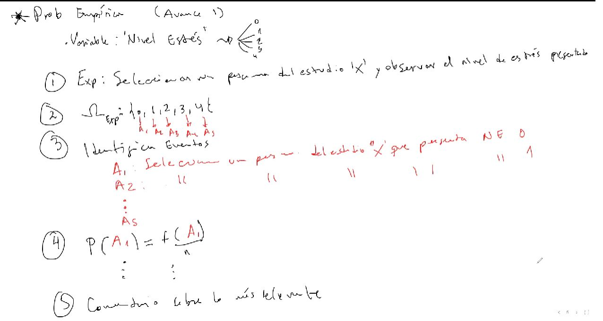
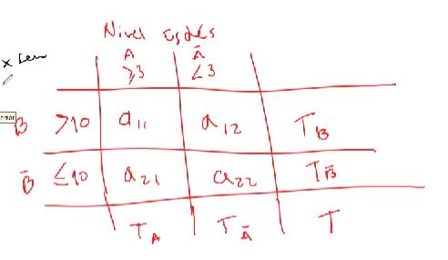
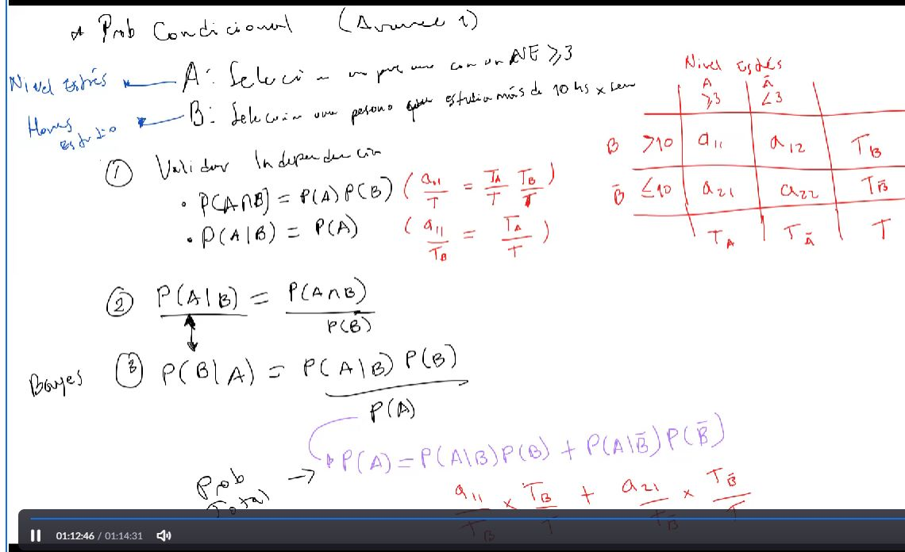

# Avance 1 de la PG02

# Probabilidad Empirica

+ Variable [Nivel de Estres]: {
    0
    1
    2
    3
    4
    5
}

## Paso 1

Experimento: Seleccionar 1 persona del estudio "X" y observar el nivel de estres presentado

## Paso 2

Ωexp = {0,1,2,3,4,5}
        son eventos atómicos asociados a ese experimento relacionados con el nivel de estres

## Paso 3

Identificar eventos

A1 seleccionar una persona del estudio X que presente un nivel de estres de 0

A2 seleccionar una persona del estudio X que presente un nivel de estres de 1

A3 seleccionar una persona del estudio X que presente un nivel de estres de 2

A4 seleccionar una persona del estudio X que presente un nivel de estres de 3

A5 seleccionar una persona del estudio X que presente un nivel de estres de 4

## Paso 4

P(A1) = f(A1)/n "La frecuencia que ocurre el evento, respecto al total"

P(A2) = f(A2)/n

.
.
.

## Paso 5

Comentarario sobre lo que mas le llama la atencion

# Probabilidada Condicional

Identificar 2 eventos

Un evento viene a partir de una variable, osea no se usa la variable en sí.

El evento sirve como experimento.

Nivel de estrés -> A: Seleccionar 1 persona con un nivel de estres mayor a 3. 

Horas de estudio -> B: Seleccionar 1 persona que estudia + de 10h a la semana.

usar notacion matricial

# 1 Validar la independencia de los eventos

Nemero de veces que vas al cine al mes con uso de tipo de trasporte

* P(A interseccion B) = P(A) * P(B) = (a11/T = Ta/T * Tb/T)

* P(A|B) = P(A) = a11/Tb = Ta/Tb

# 2 Calculo de probabilidad condicional

P(A|B) = P(A interseccion B)/P(B)

# 3 Aplicar Bayes

P(A|B) = P(B|A) * P(B)/P(A)

- Teorema de la probabilidad Total -> P(A) = P(A|B)P(B) + P(A|Bcomplemento)P(Bcomplemento)

a11/TB * TB/T + a21/TBcomplemento * TBcomplemento/T

